# Lab 02a - Manage Subscriptions and RBAC

# Student lab manual

## Rafael Román Martínez

### Enero 2023

## Lab requirements

This lab requires permissions to create Azure Active Directory (Azure AD) users, create custom Azure Role Based Access Control (RBAC) roles, and assign these roles to Azure AD users. Not all lab hosters may provide this capability. Ask your instructor for the availability of this lab.

## Lab scenario

In order to improve management of Azure resources in Contoso, you have been tasked with implementing the following functionality:

- creating a management group that would include all of Contoso’s Azure subscriptions
- granting permissions to submit support requests for all subscriptions in the management group to a designated Azure Active Directory user. That user’s permissions should be limited only to:
  - creating support request tickets
  - viewing resource groups

**Note:** An **[interactive lab simulation](https://mslabs.cloudguides.com/guides/AZ-104 Exam Guide - Microsoft Azure Administrator Exercise 2)** is available that allows you to click through this lab at your own pace. You may find slight differences between the interactive simulation and the hosted lab, but the core concepts and ideas being demonstrated are the same.

## Objectives

In this lab, you will:

- Task 1: Implement Management Groups
- Task 2: Create custom RBAC roles
- Task 3: Assign RBAC roles

## Estimated timing: 30 minutes

## Architecture diagram

[](https://microsoftlearning.github.io/AZ-104-MicrosoftAzureAdministrator/Instructions/media/lab02a.png)

## Instructions

### Exercise 1

#### Task 1: Implement Management Groups

In this task, you will create and configure management groups.

1. Sign in to the [**Azure portal**](http://portal.azure.com/).

2. Search for and select **Management groups** to navigate to the **Management groups** blade.

   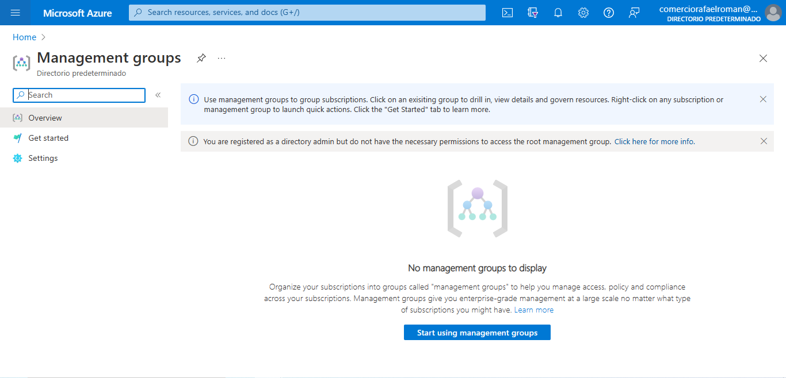

3. Review the messages at the top of the **Management groups** blade. If you are seeing the message stating **You are registered as a directory admin but do not have the necessary permissions to access the root management group**, perfom the following sequence of steps:

   1. In the Azure portal, search for and select **Azure Active Directory**.

   2. On the blade displaying properties of your Azure Active Directory tenant, in the vertical menu on the left side, in the **Manage** section, select **Properties**.

   3. On the **Properties** blade of your your Azure Active Directory tenant, in the **Access management for Azure resources** section, select **Yes** and then select **Save**.

      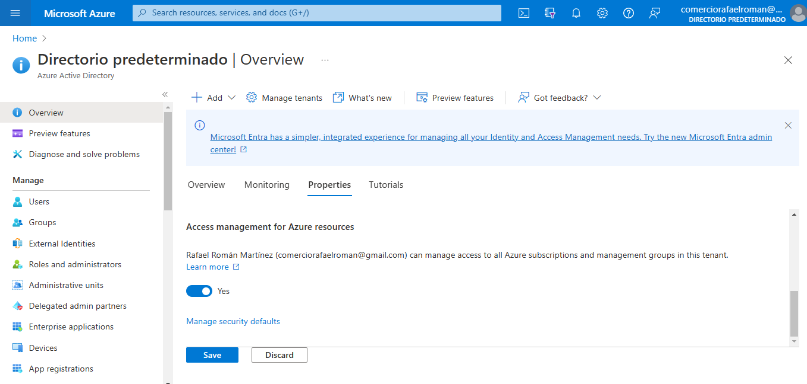

   4. Navigate back to the **Management groups** blade, and select **Refresh**.

      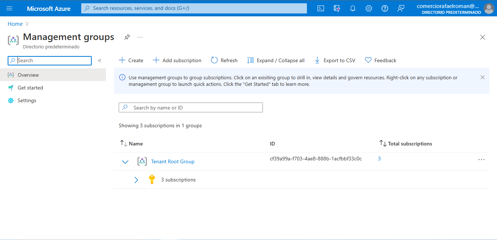

4. On the **Management groups** blade, click **+ Create**.

   > **Note**: If you have not previously created Management Groups, select **Start using management groups**

5. Create a management group with the following settings:

   | Setting                       | Value            |
   | :---------------------------- | :--------------- |
   | Management group ID           | **az104-02-mg1** |
   | Management group display name | **az104-02-mg1** |

   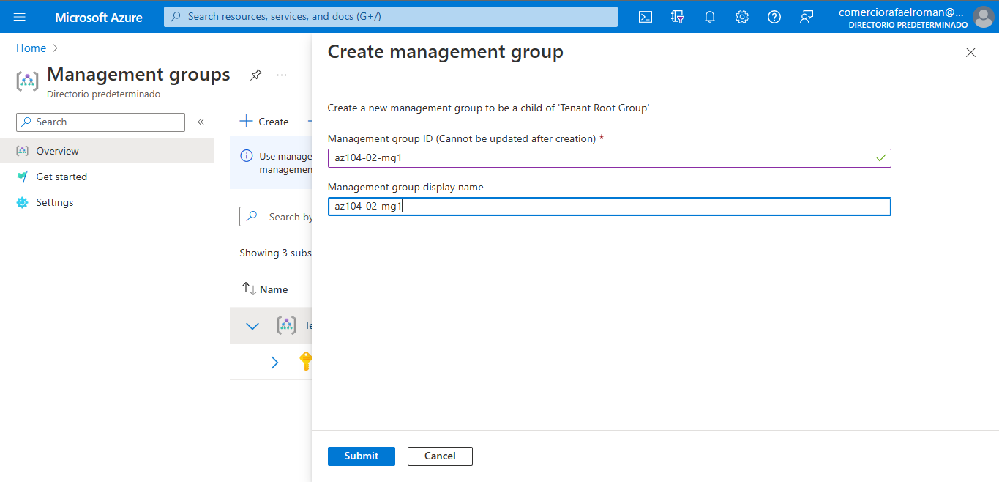

6. In the list of management groups, click the entry representing the newly created management group.

   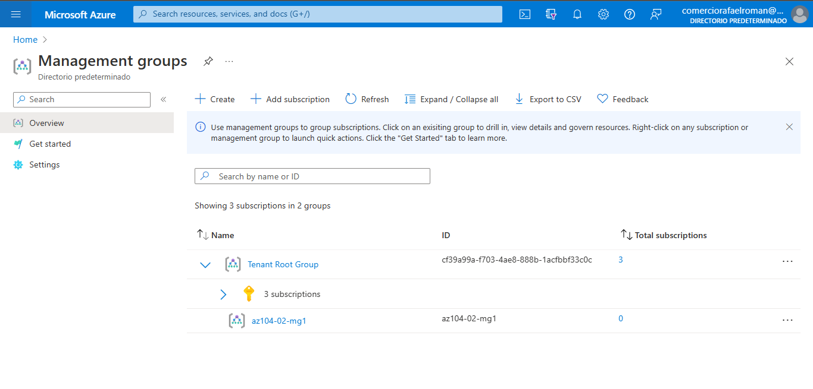

7. On the **az104-02-mg1** blade, click **Subscriptions**.

8. On the **az104-02-mg1 | Subscriptions** blade, click **+ Add**, on the **Add subscription** blade, in the **Subscription** drop-down list, select the subscription you are using in this lab and click **Save**.

   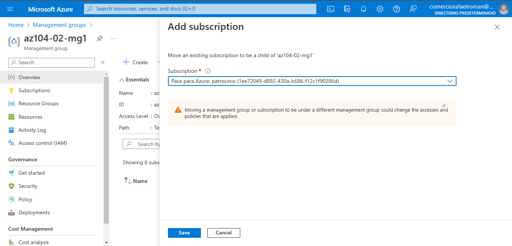

   > **Note**: On the **az104-02-mg1 | Subscriptions** blade, copy the ID of your Azure subscription into Clipboard. You will need it in the next task.

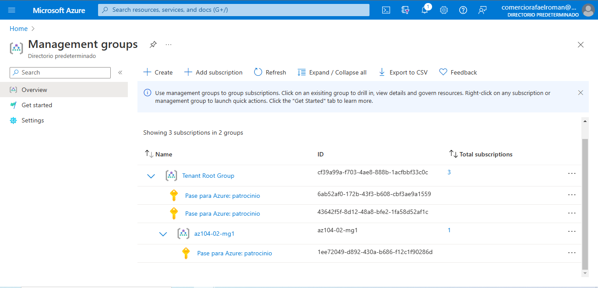

#### Task 2: Create custom RBAC roles

In this task, you will create a definition of a custom RBAC role.

1. From the lab computer, open the file **\Allfiles\Labs\02\az104-02a-customRoleDefinition.json** in Notepad and review its content:

   CodeCopy

   ```json
   {
      "Name": "Support Request Contributor (Custom)",
      "IsCustom": true,
      "Description": "Allows to create support requests",
      "Actions": [
          "Microsoft.Resources/subscriptions/resourceGroups/read",
          "Microsoft.Support/*"
      ],
      "NotActions": [
      ],
      "AssignableScopes": [
          "/providers/Microsoft.Management/managementGroups/az104-02-mg1",
          "/subscriptions/SUBSCRIPTION_ID"
      ]
   }
   ```

   > **Note**: If you are not sure where the files are stored locally in your lab environment, please ask your instructor.

   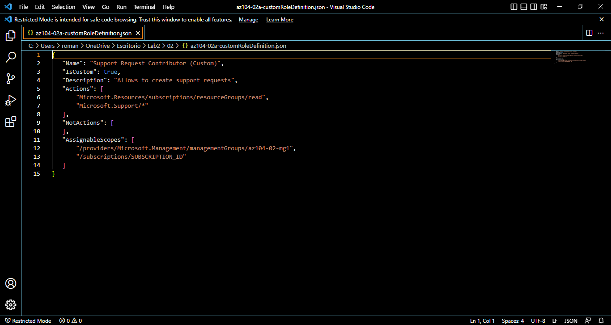

2. Replace the `SUBSCRIPTION_ID` placeholder in the JSON file with the subscription ID you copied into Clipboard and save the change.

   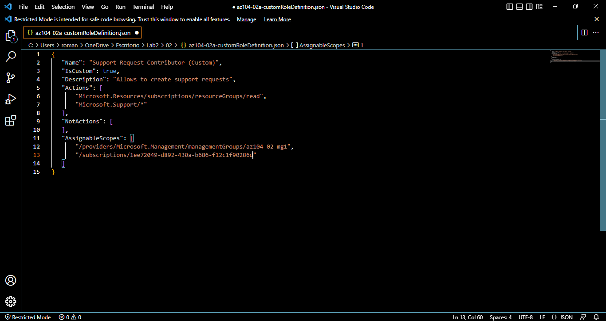

3. In the Azure portal, open **Cloud Shell** pane by clicking on the toolbar icon directly to the right of the search textbox.

4. If prompted to select either **Bash** or **PowerShell**, select **PowerShell**.

   > **Note**: If this is the first time you are starting **Cloud Shell** and you are presented with the **You have no storage mounted** message, select the subscription you are using in this lab, and click **Create storage**.

5. In the toolbar of the Cloud Shell pane, click the **Upload/Download files** icon, in the drop-down menu click **Upload**, and upload the file **\Allfiles\Labs\02\az104-02a-customRoleDefinition.json** into the Cloud Shell home directory.

   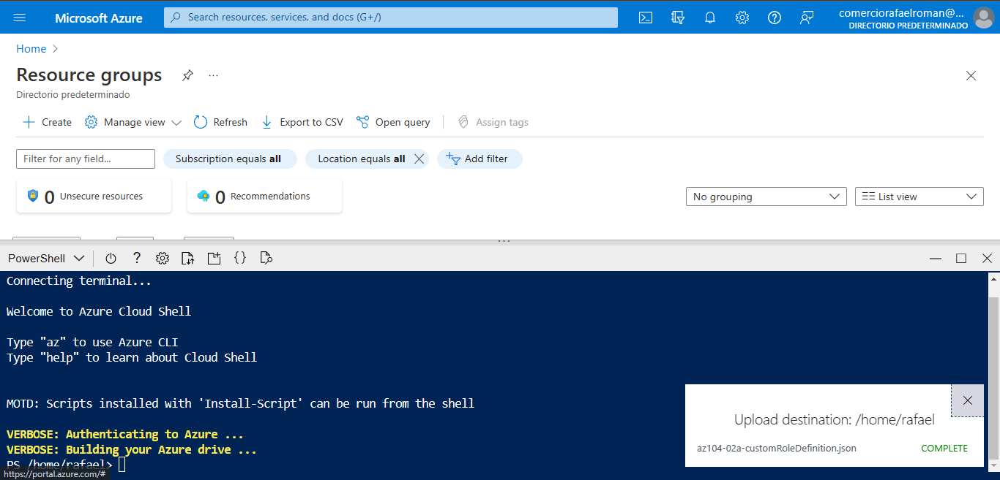

6. From the Cloud Shell pane, run the following to create the custom role definition:

   CodeCopy

   ```powershell
   New-AzRoleDefinition -InputFile $HOME/az104-02a-customRoleDefinition.json
   ```

   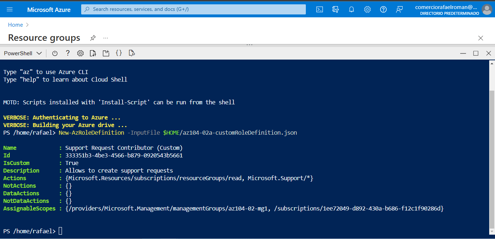

7. Close the Cloud Shell pane.

#### Task 3: Assign RBAC roles

In this task, you will create an Azure Active Directory user, assign the RBAC role you created in the previous task to that user, and verify that the user can perform the task specified in the RBAC role definition.

1. In the Azure portal, search for and select **Azure Active Directory**, on the Azure Active Directory blade, click **Users**, and then click **+ New user**.

2. Create a new user with the following settings (leave others with their defaults):

   | Setting                    | Value                         |
   | :------------------------- | :---------------------------- |
   | User name                  | **az104-02-aaduser1**         |
   | Name                       | **az104-02-aaduser1**         |
   | Let me create the password | enabled                       |
   | Initial password           | **Provide a secure password** |

   > **Note**: **Copy to clipboard** the full **User name**. You will need it later in this lab.

   

3. In the Azure portal, navigate back to the **az104-02-mg1** management group and display its **details**.

4. Click **Access Control (IAM)**, click **+ Add** and then **Add role assignment**. On the **Role** tab, search for **Support Request Contributor (Custom)**.

   

   > **Note**: if your custom role is not visible, it can take up to 10 minutes for the custom role to appear after creation.

5. Select the **Role** and click **Next**. On the **Members** tab, click **+ Select members** and **select** user account az104-***\******\******\******\**.\******\****.onmicrosoft.com. Click **Next** and then **Review and assign**.

   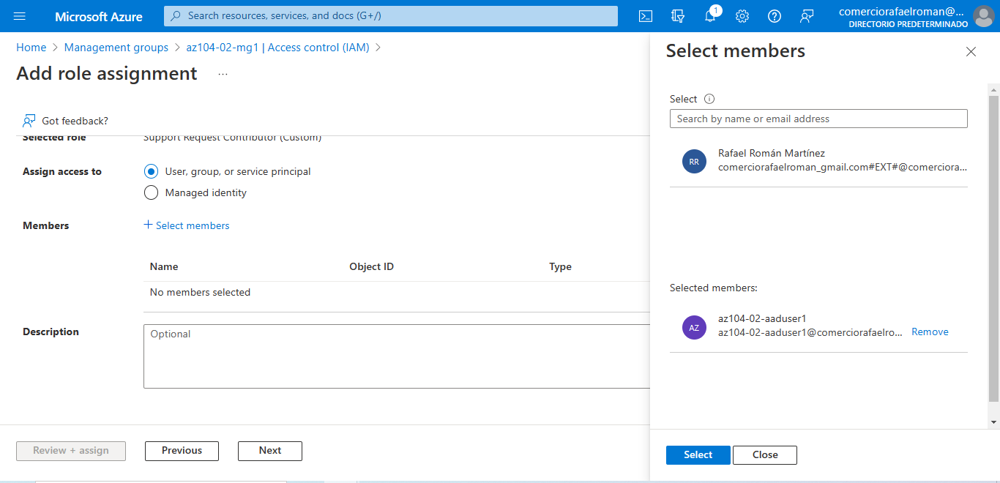

6. Open an **InPrivate** browser window and sign in to the [Azure portal](https://portal.azure.com/) using the newly created user account. When prompted to update the password, change the password for the user.

   > **Note**: Rather than typing the user name, you can paste the content of Clipboard.

7. In the **InPrivate** browser window, in the Azure portal, search and select **Resource groups** to verify that the az104-02-aaduser1 user can see all resource groups.

8. In the **InPrivate** browser window, in the Azure portal, search and select **All resources** to verify that the az104-02-aaduser1 user cannot see any resources.

9. In the **InPrivate** browser window, in the Azure portal, search and select **Help + support** and then click **+ Create a support request**.

10. In the **InPrivate** browser window, on the **Problem Description/Summary** tab of the **Help + support - New support request** blade, type **Service and subscription limits** in the Summary field and select the **Service and subscription limits (quotas)** issue type. Note that the subscription you are using in this lab is listed in the **Subscription** drop-down list.

    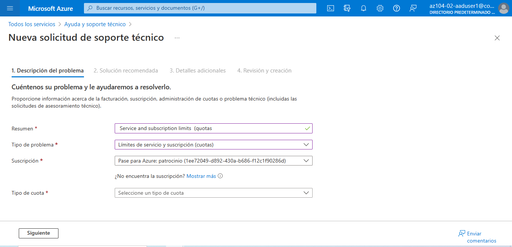

    > **Note**: The presence of the subscription you are using in this lab in the **Subscription** drop-down list indicates that the account you are using has the permissions required to create the subscription-specific support request.

    > **Note**: If you do not see the **Service and subscription limits (quotas)** option, sign out from the Azure portal and sign in back.

11. Do not continue with creating the support request. Instead, sign out as the az104-02-aaduser1 user from the Azure portal and close the InPrivate browser window.

#### Task 4: Clean up resources